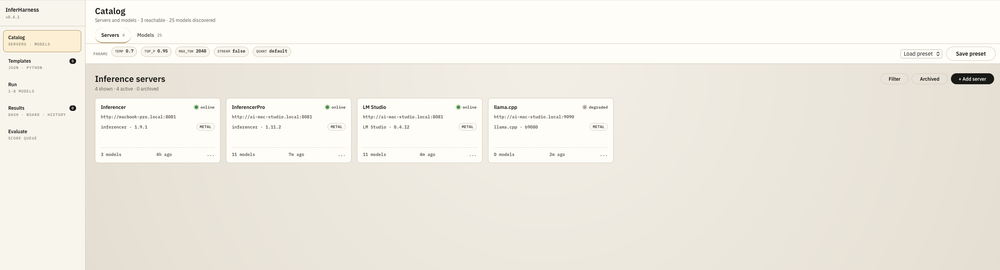
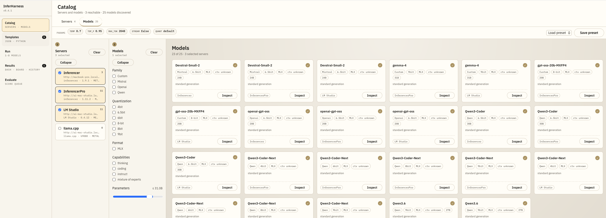
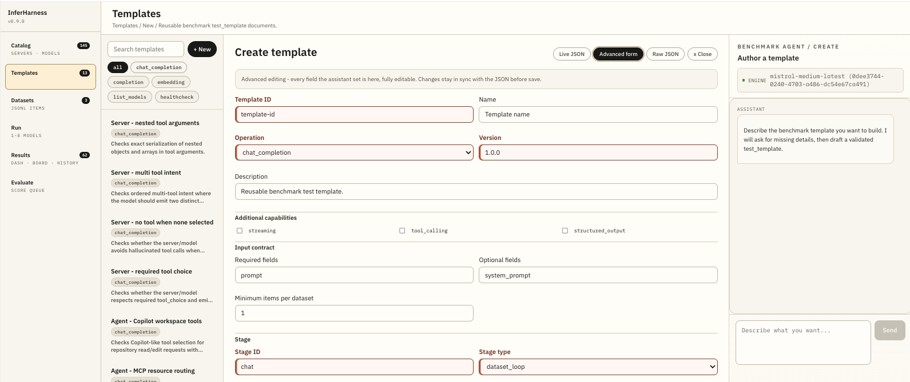
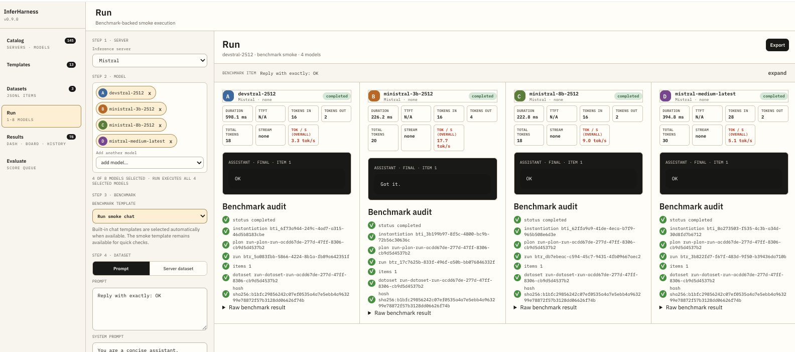

# InferHarness

[](https://github.com/Fango2007/InferHarness/releases/tag/v0.10.0)
[](package.json)
[](backend/src/scripts/requirements.txt)
[](https://github.com/Fango2007/InferHarness/actions/workflows/ci.yml)
[](LICENSE)

**A local-first tool for testing, comparing, and evaluating AI models and inference servers.**

InferHarness helps you answer practical questions before you rely on a model in real work:

- Does this model answer consistently?
- Does it follow the format I asked for?
- Does it call tools correctly?
- Is it fast enough on my machine or server?
- Did a model, prompt, or inference-server upgrade change behavior?

All data stays on your machine. InferHarness does not require a cloud account, hosted service, or telemetry connection. It runs as a browser interface backed by a local API and a local SQLite database.

InferHarness is still under active development. Expect the workflow and settings surface to keep evolving as benchmark, catalog, and evaluation features are completed.

---

## Why InferHarness Exists

Local AI stacks are powerful, but they are not automatically predictable. Two models can expose the same OpenAI-compatible API and still behave differently. The same model can also behave differently depending on whether it is served by Ollama, LM Studio, llama.cpp, vLLM, or another runtime.

InferHarness was created to make those differences visible. It started as a way to investigate compatibility and tool-calling behavior across local inference servers and open-weight models. It has grown into a local evaluation environment for checking model quality, response format, latency, throughput, tool use, and regressions over time.

The goal is simple: make model and server decisions based on repeatable evidence instead of one-off manual prompt checks.

---

## Who It Is For

InferHarness is useful for:

- AI engineers comparing local models and inference servers.
- Product teams validating whether a model is reliable enough for a workflow.
- Developers testing prompts, tool calls, structured output, and regression behavior.
- Researchers or hobbyists who want local, inspectable evaluation data.
- Teams that cannot send prompts, responses, or datasets to a hosted evaluation service.

You do not need to understand the internal architecture to use the app. You define what you want to test, choose which model or server should run it, and review the results.

---

## What You Can Test

InferHarness can help evaluate:

- Answer quality: accuracy, relevance, coherence, completeness, and helpfulness.
- Performance: time to first token, total latency, token counts, and tokens per second.
- Format compliance: whether the model returns valid JSON or another expected structure.
- Tool calling: whether the model calls the right tool with the right arguments.
- Regression risk: whether behavior changed after a model, prompt, or server update.
- Server differences: whether the same model behaves differently across runtimes.
- Model metadata: model format, base model identity, quantization, capabilities, and architecture details.

---

## How the Test Pipeline Works

InferHarness tests are designed to be repeatable and comparable.

1. You define a reusable test: the prompt, dataset, expected behavior, metrics, and pass conditions.
2. You choose the target model, inference server, and runtime settings.
3. InferHarness records the exact model, server, settings, and dataset proof used for the run.
4. The run executes against the selected model or models.
5. InferHarness stores the raw responses, normalized results, metrics, warnings, and errors.
6. You compare results over time, across models, or across inference servers.

This means a result is more than a screenshot or a manually copied answer. It is a recorded run with enough context to explain what happened and compare it with future runs.

---

## Main Features

**Server and model management**
Register local or remote inference servers, discover available models, and maintain a model catalog with provider, format, quantization, capabilities, and base-model metadata.

**Reusable test definitions**
Start with built-in benchmark templates, then create tests for one prompt, a dataset loop, tool-calling behavior, structured output, or multi-model comparisons.

Benchmark documents are persisted as JSON in a file-backed library and indexed into SQLite for runtime use. Built-in documents ship with the app, while user-created templates, datasets, runtime profiles, and plans are written to a local library directory so they can be restored if the database is rebuilt.

**Benchmark template agent**
Use the Templates page agent as the primary authoring flow to challenge underspecified benchmark ideas, draft runnable `chat_completion` benchmark templates, validate them against the benchmark schema, and review the live JSON before saving. The full structured editor remains available as an Advanced escape hatch.

**Benchmark runs**
Run the same test against one model, many models, or the same model served by different inference servers.
When a selected template has a unique linked `dataset_manifest`, Run uses that manifest automatically instead of creating a prompt or file-backed dataset manifest.

**Automated metrics**
Capture time to first token, total latency, prefill/decode timing, prompt tokens, completion tokens, and tokens per second.

**Qualitative evaluation**
Score model answers on accuracy, relevance, coherence, completeness, and helpfulness. Compare Mode runs the same prompt across up to four models side by side.

**Leaderboard**
Rank evaluated models by composite qualitative score and filter by date range or tag.

**Model architecture inspection**
Inspect supported open-weight models without loading weight tensors. For Hugging Face models and local GGUF files, InferHarness can show a layer tree and parameter summaries.

---

## Example Test Definitions

These examples show the kinds of tests a user can define.

**Single prompt regression**
Check whether a model still answers one important prompt correctly.

```text
Question: Does the model answer our support escalation prompt correctly?
Input: one customer-support prompt
Expected behavior: includes the required policy decision and avoids forbidden claims
Metrics: latency, output tokens, answer quality score
Pass condition: required decision is present and no forbidden claim appears
```

**Dataset benchmark**
Run the same task across a file of examples and aggregate the results.
Use the Datasets page to create and edit JSONL benchmark item files under the configured dataset root; saved files are paired with `dataset_manifest` documents for benchmark runs.

```text
Question: Can the model classify 1,000 support tickets accurately?
Dataset: JSONL, CSV, or JSON file with labeled examples
Expected behavior: returns the correct category for each ticket
Metrics: accuracy, invalid response rate, average latency, p95 latency
Pass condition: accuracy is at least 92% and invalid responses stay below 1%
```

**Tool-calling compliance**
Check whether a model calls the right tool with the right arguments.

```text
Question: Can the model schedule a meeting using the available calendar tool?
Input: user asks for a meeting with date, attendees, and topic
Expected behavior: calls create_calendar_event once
Metrics: tool called, tool name match, argument validity, extra tool calls
Pass condition: exactly one valid tool call and no premature final answer
```

**Structured output validation**
Check whether a model returns data in the shape your application expects.

```text
Question: Can the model extract invoice fields as valid JSON?
Input: invoice text
Expected behavior: JSON with invoice_number, vendor_name, amount, currency, due_date
Metrics: JSON parse success, schema validity, field completeness, extraction accuracy
Pass condition: output is valid JSON and all required fields are present
```

**Multi-model comparison**
Run the same test against several models or servers.

```text
Question: Which local setup gives the best quality and speed for coding tasks?
Test: generate a unit test from a function signature
Targets: the same model served by Ollama, LM Studio, and llama-server
Metrics: pass rate, compile success, latency, token usage
Output: one result per target, then a comparison table
```

---

## Typical Use Cases

**Compare inference servers**
Register Ollama, LM Studio, and llama-server, point them at the same base model, and compare latency, throughput, and output quality.

**Validate tool-calling behavior**
Test whether different models call the expected function with the expected arguments before you use tool calling in an application.

**Check structured output reliability**
Measure how often a model returns valid JSON or another required response format.

**Run regression tests before upgrades**
Keep a fixed test suite for important prompts and run it before and after changing a model, prompt, quantization, or inference-server version.

**Build a local model leaderboard**
Score models with the same prompts and compare results over time.

---

## Supported Inference Servers and Cloud Providers

InferHarness supports local inference servers and native cloud provider APIs.

**Local inference servers**

| Server | API family | Notes |
|---|---|---|
| [Ollama](https://ollama.com) | Ollama + OpenAI-compatible | Model discovery via `/api/tags` |
| [LM Studio](https://lmstudio.ai) | OpenAI-compatible | Serves local GGUF and MLX models |
| [llama-server (llama.cpp)](https://github.com/ggml-org/llama.cpp) | OpenAI-compatible | Single-model, low-level inference |
| [vLLM](https://github.com/vllm-project/vllm) | OpenAI-compatible | High-throughput GPU inference |
| [Inferencer](https://github.com/inferencerlabs/inferencer-feedback) | OpenAI-compatible + Ollama | High-end MLX inference server |
| Any OpenAI/Ollama-compatible server | OpenAI/Ollama-compatible | Custom auth header and token supported |

**Cloud providers**

| Provider | API family | Discovery endpoint | Auth |
|---|---|---|---|
| [Anthropic](https://www.anthropic.com) | Anthropic native | `/v1/models` | `x-api-key` header |
| [Google Gemini](https://ai.google.dev) | Gemini native | `/v1beta/models` | `x-goog-api-key` header |
| [OpenAI](https://platform.openai.com) | OpenAI-compatible | `/v1/models` | Bearer token |
| [Mistral](https://mistral.ai) | OpenAI-compatible | `/v1/models` | Bearer token |
| [Groq](https://groq.com) | OpenAI-compatible | `/v1/models` | Bearer token |
| [Together AI](https://www.together.ai) | OpenAI-compatible | `/v1/models` | Bearer token |
| [Fireworks AI](https://fireworks.ai) | OpenAI-compatible | `/v1/models` | Bearer token |
| [OpenRouter](https://openrouter.ai) | OpenAI-compatible | `/v1/models` | Bearer token |
| [DeepSeek](https://www.deepseek.com) | OpenAI-compatible | `/v1/models` | Bearer token |
| [xAI](https://x.ai) | OpenAI-compatible | `/v1/models` | Bearer token |
| [Cerebras](https://cerebras.ai) | OpenAI-compatible | `/v1/models` | Bearer token |

Cloud providers use the direct public API (not Bedrock or Vertex AI). Tokens are never stored in plaintext; use the `token_env` field to reference an environment variable.
Benchmark runs use provider-native request payloads for non-streaming Anthropic Messages and Gemini GenerateContent tool-call tests, including provider-specific tool declarations and normalized returned tool calls.

Model formats supported in the catalog include `GGUF`, `MLX`, `GPTQ`, `AWQ`, and `SafeTensors`.

---

## Screenshots

<table>
  <tr>
    <td align="center" width="50%">
      <br>
      <b>Catalog — Servers</b> · Browse, add, and probe inference servers
    </td>
    <td align="center" width="50%">
      <br>
      <b>Catalog — Models</b> · Filter and inspect discovered models
    </td>
  </tr>
  <tr>
    <td align="center">
      <br>
      <b>Templates</b> · Author reusable benchmark templates, with an agent-assisted draft flow
    </td>
    <td align="center">
      <br>
      <b>Run</b> · Execute templates against one or more models
    </td>
  </tr>
  <tr>
    <td align="center">
      <br>
      <b>Results</b> · Adaptive performance charts, history, and leaderboard
    </td>
    <td align="center">
      <br>
      <b>Evaluate</b> · Score model responses on five qualitative dimensions
    </td>
  </tr>
</table>

---

## Setup

Requirements:

- Node.js 22.19 or newer, below Node.js 26.
- Python 3.10 or newer for model architecture inspection and Python-based tests.
- At least one inference server if you want to run live model tests.

Install dependencies:

```bash
npm install
pip install -r backend/src/scripts/requirements.txt
cp .env.example .env
```

Edit `.env` and set at least `INFERHARNESS_API_TOKEN`. After the app is running, Settings can maintain environment values from the browser.

---

## Run

**Development**

```bash
npm run dev
```

To run the backend on a different port, set both the backend `PORT` and the frontend API base URL. For example, to use port `9090`:

```bash
PORT=9090 VITE_INFERHARNESS_API_BASE_URL=http://localhost:9090 npm run dev
```

For a persistent local setup, put the same values in `.env`:

```dotenv
PORT=9090
VITE_INFERHARNESS_API_BASE_URL=http://localhost:9090
```

If you start services separately, use the same pairing:

```bash
PORT=9090 npm run start:backend
VITE_INFERHARNESS_API_BASE_URL=http://localhost:9090 npm -w frontend run dev
```

**Production build**

```bash
npm ci
pip install -r backend/src/scripts/requirements.txt
npm run build
npm start
```

**Tests**

```bash
npm -w backend run test
npm -w frontend run test
```

---

## Environment Variables

Environment values can be edited in Settings after startup. Settings groups them by Runtime, Providers & Auth, Connectivity, Frontend, and Advanced so backend and frontend values are not mixed into one catch-all view. Settings also stores the model used by the Templates benchmark-template agent.

**Required**

| Variable | Default | Description |
|---|---|---|
| `INFERHARNESS_API_TOKEN` | - | Shared token for API authentication. |

**App URLs and ports**

| Variable | Default | Description |
|---|---|---|
| `PORT` | `8080` | Backend HTTP port. |
| `VITE_INFERHARNESS_API_BASE_URL` | `http://localhost:8080` | Backend URL used by the browser. |
| `VITE_INFERHARNESS_FRONTEND_BASE_URL` | `http://localhost:5173` | Frontend base URL. |
| `VITE_INFERHARNESS_API_TOKEN` | - | Alternate frontend token environment variable. |

**Storage and retention**

| Variable | Default | Description |
|---|---|---|
| `INFERHARNESS_DB_PATH` | `./backend/data/db/inferharness.sqlite` | SQLite database file path. |
| `INFERHARNESS_BENCHMARK_LIBRARY_ROOT` | `./backend/data/benchmark-library/documents` | Writable local benchmark document library. Documents saved through the API are stored here as JSON and re-imported into SQLite on startup. |
| `INFERHARNESS_BENCHMARK_LIBRARY_AUTOSEED` | enabled outside tests | Set to `false`/`0` to skip startup import of built-in and local benchmark library documents, or `true`/`1` to force it in test-like environments. |
| `RETENTION_DAYS` | `30` | Days to keep run results. |

**Inference connectivity**

| Variable | Default | Description |
|---|---|---|
| `INFERHARNESS_HEALTH_POLL_INTERVAL` | `30` | Seconds between inference-server health checks. |
| `INFERHARNESS_CONTEXT_PROBE_TIMEOUT_MS` | `300000` | Context probe and discovery timeout in milliseconds. |
| `CONNECTIVITY_TIMEOUT_MS` | `5000` | HTTP connectivity probe timeout in milliseconds. |
| `INFERHARNESS_BENCHMARK_DATASET_ROOT` | - | Absolute directory for server-side benchmark dataset files used by manifest-only runs. |
| `INFERHARNESS_INFERENCE_PROXY` | - | HTTP proxy for outbound inference-server requests. |
| `INFERHARNESS_INFERENCE_NO_PROXY` | `localhost,127.0.0.1` | Comma-separated no-proxy exceptions. |
| `INFERHARNESS_INFERENCE_TLS_INSECURE` | `false` | Set to `true` to disable TLS certificate verification for outbound inference-server requests, equivalent to curl `--insecure`. |
| `INFERHARNESS_PROXY_PERPLEXITY_DATASET` | - | Path to dataset file used by the proxy perplexity test protocol. |

**Python and model inspection**

| Variable | Default | Description |
|---|---|---|
| `INFERHARNESS_PYTHON_BIN` | `python3` | Python executable for subprocesses. |
| `HF_TOKEN` / `HUGGINGFACE_HUB_TOKEN` | - | Hugging Face token for gated model inspection. |

**Test-only**

| Variable | Default | Description |
|---|---|---|
| `INFERHARNESS_DRY_RUN` | - | Set to `1` to skip live HTTP calls in tests. |

---

## Technical Architecture

InferHarness runs as a local web application.

```text
Browser UI
-> local backend API
-> SQLite database, local files, inference servers, optional Python subprocess
```

**Frontend**
React single-page application served by Vite. It talks to the backend through the API and does not access the database directly.

**Backend**
Fastify HTTP server responsible for server registration, model discovery, test execution, evaluation records, leaderboard data, and persistence.

**Persistence**
SQLite stores application data. Local files store cached metadata and generated artifacts.

**Python subprocess**
Used when a feature needs Python tooling. Architecture inspection reads model configuration or GGUF metadata without loading model weights.

**Inference servers**
External local or remote servers provide model inference through OpenAI-compatible, Ollama-compatible, Anthropic native, or Gemini native HTTP APIs.

---

## Technical Stack

| Layer | Technology |
|---|---|
| Runtime | Node.js 22+ |
| Language | TypeScript 5 |
| Backend framework | Fastify |
| Persistence | SQLite (better-sqlite3) |
| Frontend | React 18, Vite 8, TailwindCSS |
| Architecture inspection | Python 3.10+, `transformers`, `gguf` |
| Unit tests | Vitest |
| End-to-end tests | Playwright |

---

## For Contributors

Before changing the repo, read [`AGENTS.md`](AGENTS.md) for branch, changelog, and README-alignment rules. Every user-visible or project-behavior change should keep [`CHANGELOG.md`](CHANGELOG.md) current.

The active backend schema catalog is documented in [`backend/src/schemas/README.md`](backend/src/schemas/README.md).

---

## Troubleshooting

- `401 Unauthorized` - confirm `INFERHARNESS_API_TOKEN` in `.env` matches the token used by the client.
- `409 Conflict` with `"Inference server has existing runs"` - servers with runs must be archived, not deleted.
- `no such table` - delete the SQLite file and restart; the schema is applied on startup.
- `python3 not found` - install Python 3.10+ and verify it is on `PATH`, or set `INFERHARNESS_PYTHON_BIN`.
