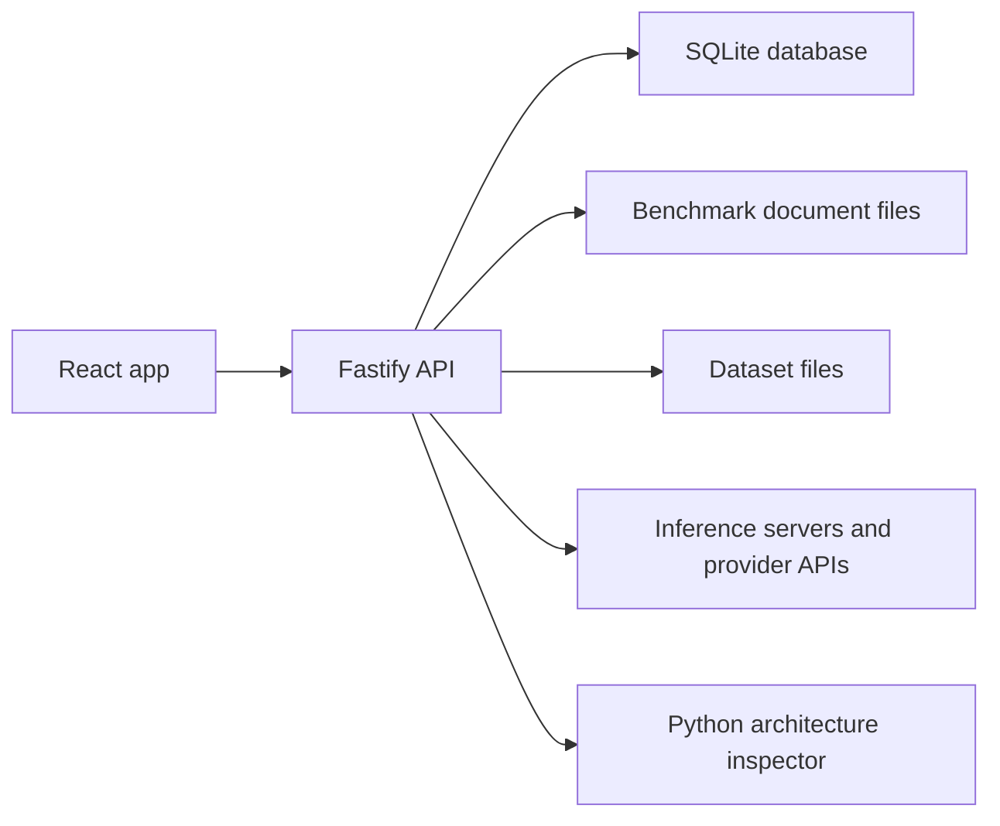

# InferHarness App Architecture

Status: Current architecture overview

Last updated: 2026-07-25

## 1. Purpose

This document describes the current InferHarness application architecture at the
system and module-boundary level. It is intended to help contributors understand
where major responsibilities live before changing the app.

This document does not define benchmark execution internals, metric formulas, or
document contracts. Those are separate specifications and should be updated in
their own checkpoint.

## 2. Runtime Shape

InferHarness is a local-first web app with two Node workspaces:

| Layer | Workspace | Main technologies | Responsibility |
|---|---|---|---|
| Frontend | `frontend` | React, Vite, React Router | Browser UI, navigation, local app state, API clients |
| Backend | `backend` | Fastify, better-sqlite3, Undici | Local HTTP API, persistence, provider calls, document library management |
| Storage | `backend/data` by default | SQLite, JSON files | Registered servers, models, runs, results, settings, and user benchmark documents |

The root workspace coordinates both sides with npm scripts. `npm run dev` starts
the backend and frontend together; separate backend and frontend commands are
available when a custom port or browser API base URL is needed.

## 3. Startup

The backend entry point is `backend/src/index.ts`.

Startup performs these app-level steps:

1. Ensure local API token environment entries exist in `.env`.
2. Load environment variables.
3. Configure outbound inference proxy and TLS behavior when requested.
4. Create the Fastify server from `backend/src/api/server.ts`.
5. Listen on `PORT`, defaulting to `8080`.

Server creation applies the database definition, runs lightweight column
migrations, loads built-in and user benchmark library documents when autoseeding
is enabled, registers authentication, installs CORS and security headers,
exposes `/health`, and registers feature route modules.

The frontend API base URL defaults to `http://localhost:8080` and can be
overridden with `VITE_INFERHARNESS_API_BASE_URL`. The frontend sends
`VITE_INFERHARNESS_API_TOKEN` as `x-api-token` when configured.

## 4. Frontend Architecture

The frontend entry point is `frontend/src/App.tsx`. It owns the app shell,
top-level route map, sidebar health state, settings modal wiring, and onboarding
state.

Main routes are:

| Route | Page/component | Purpose |
|---|---|---|
| `/welcome` | `WelcomeCanvas` | First-run onboarding entry |
| `/catalog` | `Catalog` | Server and model catalog |
| `/catalog/models/:id` | `ModelDetails` | Model inspection view for a selected server/model |
| `/templates` | `Templates` | Benchmark template browsing and authoring UI |
| `/datasets` | `Datasets` | Dataset-file editor |
| `/run` | `RunUnified` | Run workspace |
| `/results` | `ResultsUnified` | Results dashboard, history, and detail views |
| `/evaluate` | `Evaluate` | Manual evaluation queue and scoring |

The shell polls or refreshes:

- backend health through `/health`;
- database health through `/system/metrics`;
- inference-server connectivity through `/inference-servers/health`;
- sidebar counts from benchmark documents, dataset files, models, and results.

Frontend API access is kept in `frontend/src/services/*-api.ts`. Page
components call those service modules instead of constructing HTTP requests
directly. Shared presentation components live in `frontend/src/components`, and
shared route helpers live in `frontend/src/navigation.ts`.

## 5. Backend Architecture

The backend is organized around route modules, services, models, and adapters.

| Area | Location | Responsibility |
|---|---|---|
| HTTP server | `backend/src/api/server.ts` | Fastify setup, middleware, health endpoint, route registration |
| Route modules | `backend/src/api/routes` | Feature-specific HTTP contracts and request/response handling |
| Services | `backend/src/services` | Business logic, provider calls, persistence orchestration, validation helpers |
| Models/repositories | `backend/src/models` | SQLite connection, database definition, row mapping, repository functions |
| Adapters | `backend/src/adapters` | External or format-specific integration logic |
| Scripts | `backend/src/scripts` | Environment bootstrap and model architecture inspection helpers |

Route modules stay thin where possible: they parse request parameters, call a
service or repository function, map expected domain errors to HTTP status codes,
and return sanitized payloads.

Services hold most application behavior. Examples include server discovery,
connectivity checks, model metadata normalization, benchmark document library
management, result views, evaluation queue handling, retention jobs, system
settings, and outbound inference request handling.

## 6. Persistence

InferHarness uses SQLite as the local runtime database. The default database path
is `backend/data/db/inferharness.sqlite`, unless `INFERHARNESS_DB_PATH` is set.
Tests use a separate backend-test database path unless explicitly configured.

The database definition is applied from `backend/src/models/schema.sql` at
backend startup. The active database stores:

- registered inference servers and discovered models;
- run and result records;
- benchmark result documents and indexed benchmark documents;
- manual evaluation prompts, scores, and queue skip state;
- model architecture inspection settings;
- inference parameter presets;
- app settings.

Some durable user-authored content is also file-backed:

- benchmark documents are stored under
  `INFERHARNESS_BENCHMARK_LIBRARY_ROOT`, defaulting to
  `backend/data/benchmark-library/documents`;
- dataset item files are stored under `INFERHARNESS_BENCHMARK_DATASET_ROOT`
  when that root is configured.

The file-backed library lets user-created documents be re-imported into SQLite
after a database rebuild.

## 7. Provider and Model Integration

Inference servers are registered through the Catalog flow and stored as
`inference_servers` records. Server records include endpoint, auth, capability,
discovery, and raw metadata fields. API responses sanitize tokens and expose only
token presence.

The backend supports multiple provider families at the app boundary:

- OpenAI-compatible APIs;
- Ollama APIs;
- Anthropic native APIs;
- Gemini native APIs;
- custom or partially probed servers.

Server probing and discovery are handled by the inference-server services and
provider adapters. Outbound calls use the backend fetch layer, which can honor
`INFERHARNESS_INFERENCE_PROXY`, `INFERHARNESS_INFERENCE_NO_PROXY`, and
`INFERHARNESS_INFERENCE_TLS_INSECURE`.

Discovered models are normalized into model records with identity, architecture,
modality, capability, limit, performance, configuration, discovery, and raw
metadata sections. Model details can launch the architecture inspector for
supported Hugging Face, local GGUF, MLX, GPTQ, AWQ, or safetensors targets.

## 8. Major Feature Areas

### 8.1 Catalog

Catalog manages inference servers and discovered models. It handles server
creation, update, archive/unarchive, deletion, probing, runtime refresh,
discovery refresh, connectivity display, and model browsing.

### 8.2 Templates

Templates is the benchmark document authoring surface. It reads and writes
template documents through the benchmark document API and can use the template
agent configured in Settings.

### 8.3 Datasets

Datasets manages local dataset item files under the configured dataset root and
keeps saved files paired with document records for later use.

### 8.4 Run

Run is the execution workspace. At the architecture level it connects selected
servers, models, templates, datasets, runtime choices, and persisted run results.
The detailed execution flow is intentionally outside this document.

### 8.5 Results

Results reads benchmark-native result views from the backend and presents
history, detail drawers, comparison panels, adaptive charts, and deletion flows.

### 8.6 Evaluate and Leaderboard

Evaluate supports manual qualitative scoring for model answers and queued
benchmark results. Leaderboard aggregates stored evaluations for model ranking.

### 8.7 Settings

Settings manages environment entries, the template-agent model selection,
database clearing, and onboarding reset/replay actions. Database clearing reloads
the built-in benchmark library so the app remains usable after reset.

## 9. Dependency Direction

The intended dependency direction is:

1. Frontend pages depend on frontend service modules and shared components.
2. Frontend service modules depend on the backend HTTP API.
3. Backend route modules depend on backend services and repositories.
4. Backend services depend on repositories, adapters, validators, and outbound
   HTTP helpers.
5. Repositories depend on the SQLite connection and row-mapping helpers.

Static prompts, built-in benchmark documents, and other long-lived reference
content should remain in dedicated files. Application code should orchestrate,
validate, transform, and persist that content rather than embedding large static
payloads inline.

## 10. Boundary Rules for Future Changes

- Keep route modules thin and put reusable behavior in services.
- Keep frontend HTTP access inside `frontend/src/services`.
- Preserve the local-first storage model unless a change explicitly revises it.
- Sanitize tokens and secret-bearing fields before returning server records.
- Update this document when app-level responsibilities, feature boundaries, or
  runtime topology changes.
- Document benchmark execution internals and document contracts separately.
